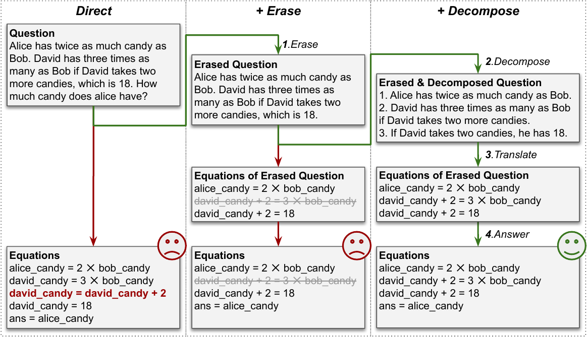

# Boosting Numerical Reasoning by Decomposing the Generation of Equations

This repository contains code and analysis for the paper: [Exploring Equation as a Better Intermediate Meaning Representation for Numerical Reasoning of Large Language Models](https://arxiv.org/abs/2308.10585). Below is the framework of our proposed method (rightmost part).



## Inference with Bridge

1. create python environment with conda:
```bash
conda create -n bridge -r requirements.txt python=3.7
conda activate bridge
```

2. change openai.api_base and openai.api_key with yours in [utils.py](./utils.py)

3. change experiment settings in run.sh and run the bash:
```bash
bash run.sh
```

## Experiment Result
The experiment result with code-davinci-002 using different prompt methods are shown in the table below.
Compared with previous works, our method achieves great improvement on all experimental datasets, showing the effectivness of our method.

Method | GSM8K | SVAMP | Algebra
--- | --- | --- | ---
CoT | 65.6 | 74.8 | 47.9
Tab-CoT | 61.6 | 82.9 | -
Declarative | 69.4 | - | 76.3
PoT | 71.6 | 85.2 | -
PAL | 72.0 | 79.4 | 56.2
**Bridge** | **74.2±0.4** | **86.1±0.5** | **78.5±1.7**

## Citation
```
@misc{wang2023exploring,
      title={Exploring Equation as a Better Intermediate Meaning Representation for Numerical Reasoning}, 
      author={Dingzirui Wang and Longxu Dou and Wenbin Zhang and Junyu Zeng and Wanxiang Che},
      year={2023},
      eprint={2308.10585},
      archivePrefix={arXiv},
      primaryClass={cs.CL}
}
```